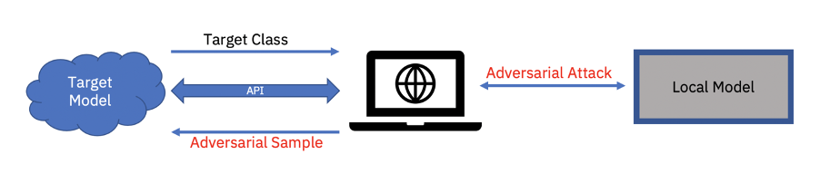

# Adversarial Learning Attacks

## White box Adversarial Learning Attacks

It is assumed that attackers have access to the prediction pipeline of target applications such as input details, access to layers, model weights, details regarding inference of outputs. This information can make it easier to generate adversarial samples.

Examples: [Projected Gradient Descent](https://arxiv.org/abs/1706.06083), [Decision Tree Attack](https://arxiv.org/abs/1605.07277)

## Black box Adversarial Learning Attacks

Most of the time the model is deployed on cloud and the user has only API access to the model. Not having direct access to model information indeed makes it difficult to generate adversarial samples but it’s not impossible. Research has shown that the adversarial samples are transferable.

Examples: [HopSkipJump Attack](https://arxiv.org/abs/1904.02144), [Decision-based/Boundary Attack](https://arxiv.org/abs/1712.04248)

## Sample Notebooks

To understand more about these attacks, run the following jupyter notebooks. These notebooks are provided in this git repo under respective folders. Use the below links to open them.

[Link to white box attacks](https://github.com/rachvis/Adversarial-Learning-Attacks/tree/master/White-Box-Attacks)

[Link to black box Attacks](https://github.com/rachvis/Adversarial-Learning-Attacks/tree/master/Black-Box-Attacks)
